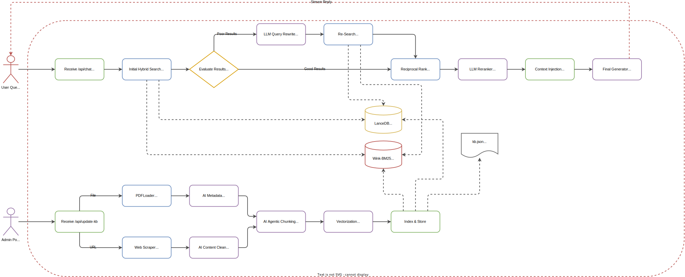

# 🤖 Delyva FAQ Assistant ✨

Welcome to the **Delyva FAQ Assistant**, a modern, full-stack application designed to provide an intelligent Retrieval-Augmented Generation (RAG) chatbot experience. Built with React and Express, it seamlessly integrates with Google's Gemini AI, Groq AI and LanceDB to provide accurate, context-aware answers from your custom knowledge base. In just a few easy steps, you can upload PDFs or web links, process them, and let the bot answer queries based on the provided documents!

- [🎯 What Is Delyva FAQ Assistant?](#what-is-delyva-faq-assistant)
- [✨ Features](#-features)
- [🚀 Try It Out!](#-try-it-out)
- [🔑 Environment Variables](#-environment-variables)
- [📚 Data Ingestion](#-data-ingestion)
- [❔ FAQ](#-faq)

## What Is Delyva FAQ Assistant?
Delyva FAQ Assistant is a custom-built support bot utilizing Hybrid Search RAG pipelines for querying and interacting with your support documentation. It leverages Google Gemini for powerful generative capabilities, LanceDB for fast vector search, and BM25 for keyword search, ensuring highly accurate retrieval. The system is split into a robust Express backend to protect your API keys and a responsive React frontend for an optimal user experience.

## 🏛️ Architecture Diagram

  

---

## ✨ Features

| 🤖 Model Support | Implemented | Description |
| --- | --- | --- |
| Google Gemini | ✅ | Embedding and Generation Models powered by Google GenAI |
| Groq | ✅ | Fast generation API via Groq |

| 📁 Data Support | Implemented | Description |
| --- | --- | --- |
| PDF Ingestion | ✅ | Upload and parse `.pdf` documents (`pdf-parse`) |
| Web Scraping | ✅ | Provide URLs to be automatically scraped and ingested (`cheerio`) |

| ✨ RAG Features | Implemented | Description |
| --- | --- | --- |
| Hybrid Search | ✅ | Semantic Search (LanceDB) combined with Keyword Search (BM25) |
| Agentic Chunking | ✅ | AI-driven semantic chunking powered by LangChain and Gemini |
| Query Rewriting | ✅ | Intelligent rewriting of user queries for optimal search results |
| Pause Generation | ✅ | Functional pause button to interrupt ongoing bot responses |
| Observability | ✅ | Full RAG pipeline tracing via Langfuse |

---

## 🚀 Try It Out!

You can start using the live Delyva FAQ Assistant immediately:  
**[👉 Access the Live Bot Here](https://delyva-knowledge-assistant.onrender.com)**

---

## 🔑 Environment Variables

To run the application, you need to configure the following environment variables in a `.env` file at the root of your project:

| Environment Variable | Description |
| --- | --- |
| `GEMINI_API_KEY` | **Required**. Your Google Gemini API Key |
| `GROQ_API_KEY` | Your Groq API Key |
| `LANGFUSE_SECRET_KEY` | Secret Key for Langfuse Observability |
| `LANGFUSE_PUBLIC_KEY` | Public Key for Langfuse Observability |
| `LANGFUSE_HOST` | Host URL for Langfuse (e.g., `https://cloud.langfuse.com`) |

> You can copy `.env.example` to `.env` to get started quickly.

---

## 📚 Data Ingestion

The application provides a built-in admin interface to easily upload and manage knowledge base documents:
- **Add Files**: Upload PDF documents. The backend will parse the text and generate semantic chunks.
- **Add URL**: Provide website links. The system will crawl the page, extract relevant text using Cheerio, and add it to the database.

Once uploaded, the data is stored in the local `kb.json` and LanceDB vector store, immediately becoming available for the FAQ Bot to retrieve.

---

## ❔ FAQ

- **Are my API keys safe?**
  Yes! The architecture is intentionally separated. The React frontend communicates only with the Express backend. Your `GEMINI_API_KEY` is safely stored on the server side and is never exposed to the client.
  
- **How is the search performed?**
  We use a Hybrid Search approach. It combines BM25 keyword matching (via `wink-bm25-text-search`) with semantic vector similarity (via LanceDB) to find the most accurate chunks for answering a user's query.

- **Can I stop the bot from generating a long response?**
  Yes, there is a built-in pause/stop functionality on the frontend UI to abort the generation stream.
